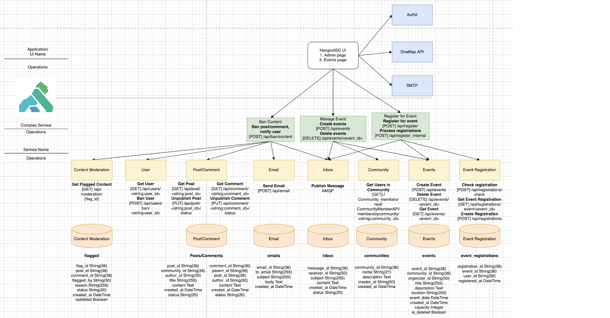
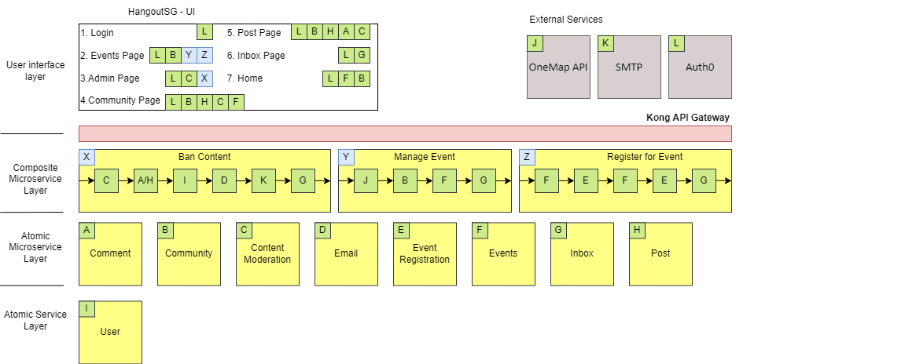

# HangoutSG
## Project undergoing migration from OutSystems Low Code Platform to Flask

### G10 Team 5

HangoutSG aims to connect users with similar hobby interests through both online interactions and in-person meetups. The platform serves two primary purposes: facilitating online discussions through forum posts and enabling users to organize and join real-world events. The target audience consists of hobby enthusiasts across Singapore looking to connect with others sharing their interests.


## Table of Contents

1. [Getting Started](#getting-started)
2. [Technical Overview Diagram](#technical-overview-diagram)
3. [SOA Layer Diagram](#soa-layer-diagram)
4. [Technologies Used](#technologies-used)

## Getting Started

### Prerequisites

1. Docker ([Windows](https://docs.docker.com/desktop/install/windows-install/) | [MacOS](https://docs.docker.com/desktop/install/mac-install/))

### Getting Started (Docker Compose)

1. To start the docker deployment, run the following command in the root folder:

```bash
$ docker compose up -d
```

2. To tear down the deployment, run the following command in the root folder:

```bash
$ docker compose down
```

3. To tear down the deployment and volumes, run the following command in the root folder:

```bash
$ docker compose down -v
```

## Technical Overview Diagram


## SOA Layer Diagram


## Technologies Used

<p align="center"><strong>Frontend Stack</strong></p>
<p align="center">
    
    
    
    
</p>

<p align="center"><strong>Authentication</strong></p>
<p align="center">
    
</p>

<p align="center"><strong>Backend Stack</strong></p>
<p align="center">
    
    
    
    
    
</p>

<p align="center"><strong>API Gateway</strong></p>
<p align="center">

</p>

<p align="center"><strong>Storage Solutions</strong></p>  
<p align="center">


</p>

<p align="center"><strong>Message Broker</strong></p>
<p align="center">

</p>

<p align="center"><strong>Architecture & Design</strong></p>
<p align="center">


</p>

<p align="center"><strong>Containerization & Deployment</strong></p>
<p align="center">


</p>
